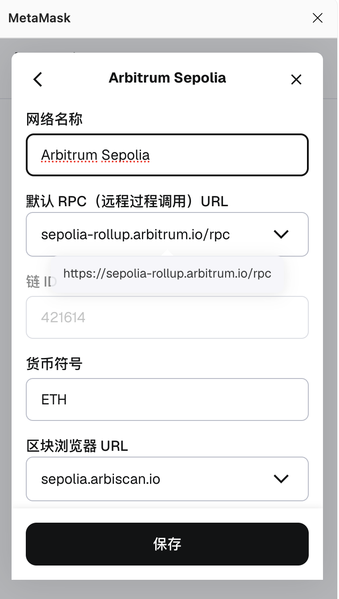
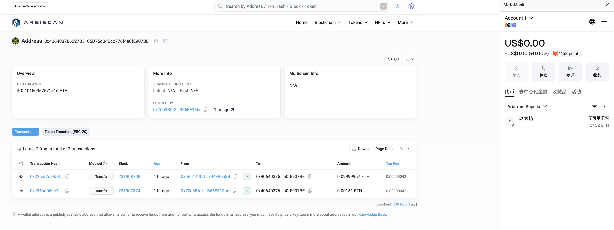
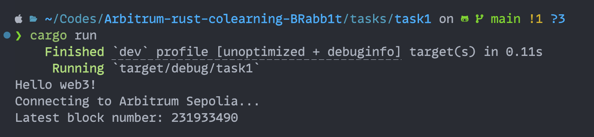
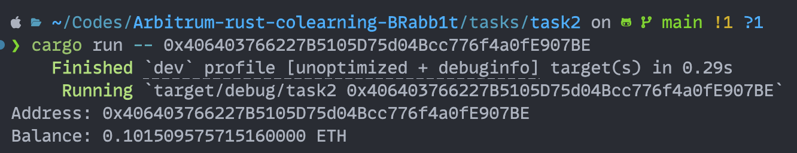
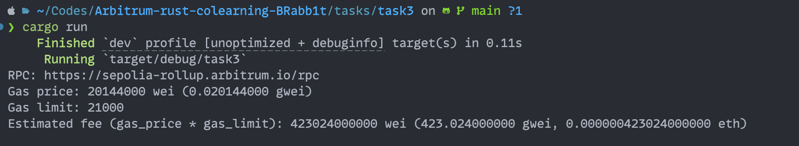
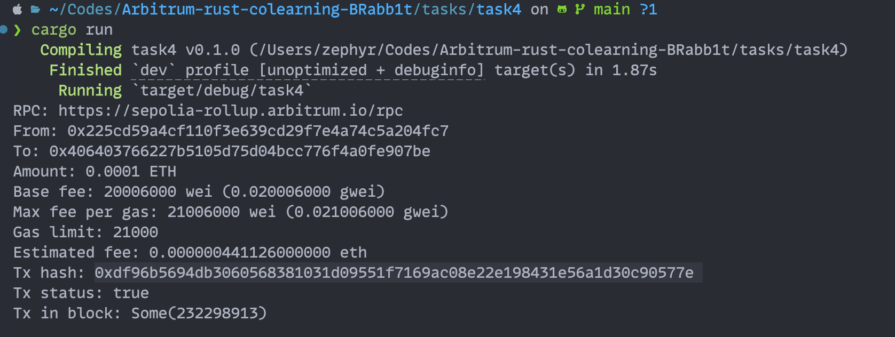
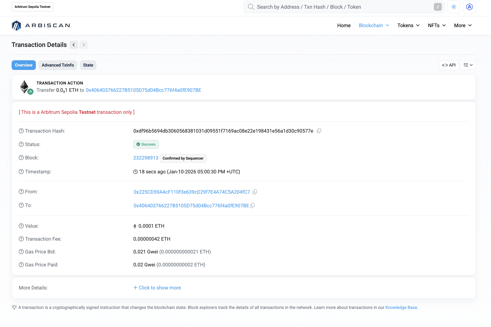

# Arbitrum-rust-colearning-BRabb1t
---
## Task1
### 1.1 切换Arb测试网

### 1.2 领取测试代币

### 1.3 编写并本地运行Task1程序
运行:
- cd tasks/task1
- cargo run
- 运行结果图

---

## Task2
### 本关卡代码路径 tasks/task2
### 运行结果截图
运行:
- cd tasks/task2
- cargo run -- 0x324(需要查询的地址)
- 运行结果图

---

## Task3
### 本关卡代码路径 tasks/task3
### 运行结果截图
运行:
- cd tasks/task3
- cargo run
- 运行结果图

---

## Task4
### 本关卡代码路径 tasks/task4
### 运行结果截图
运行:
- cd tasks/task4
- cargo run
- 运行结果图

- 区块浏览器查询记录

---